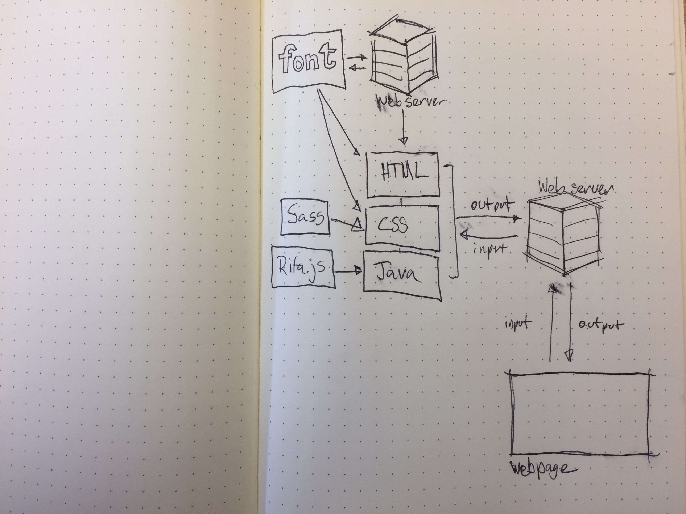
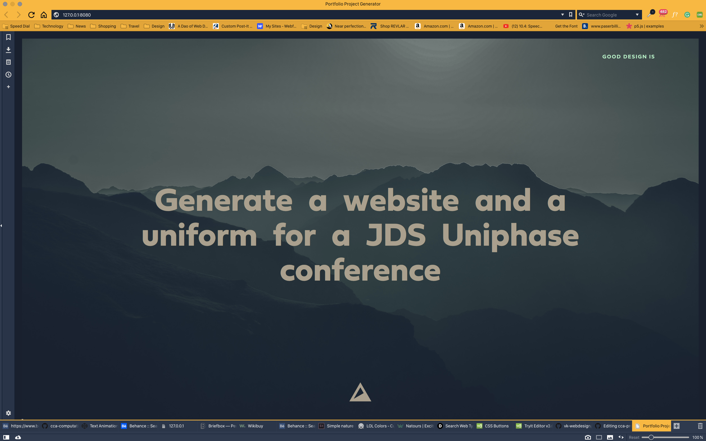
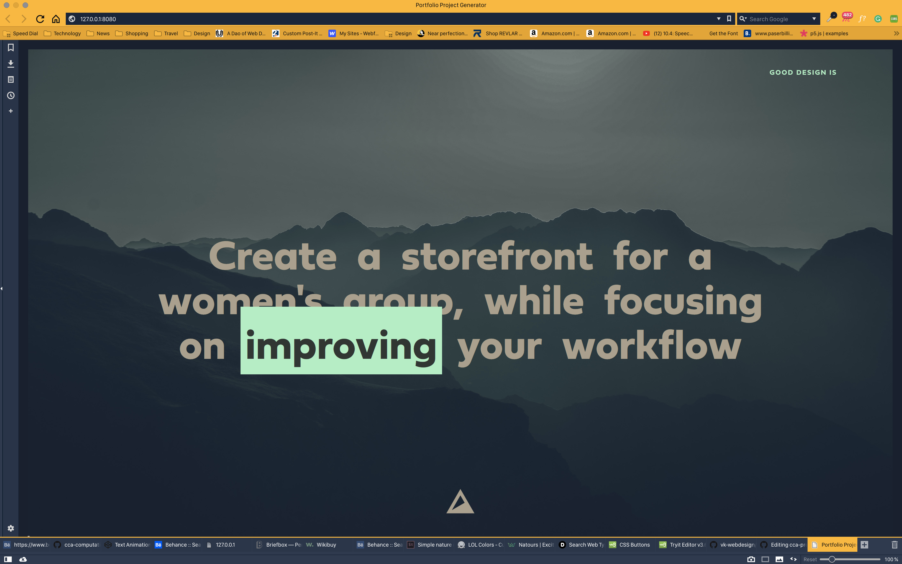
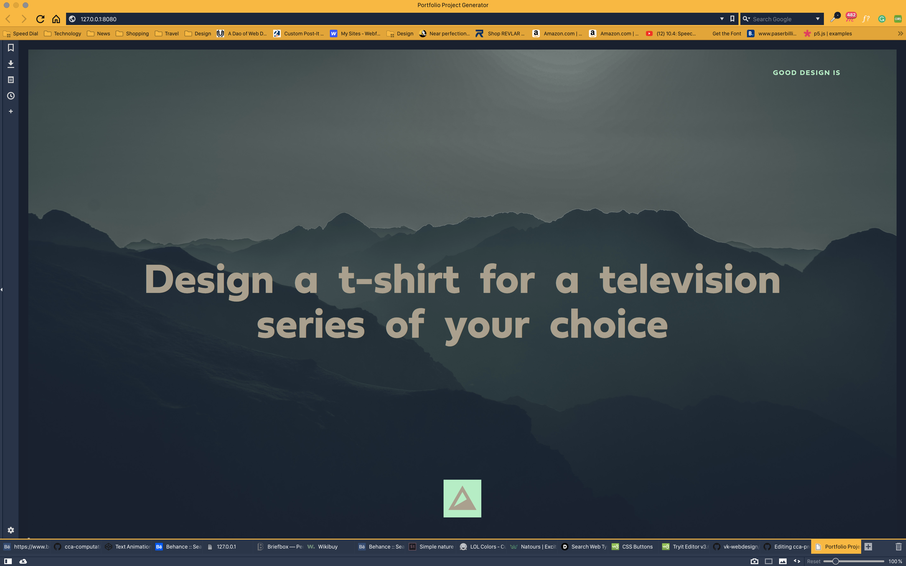
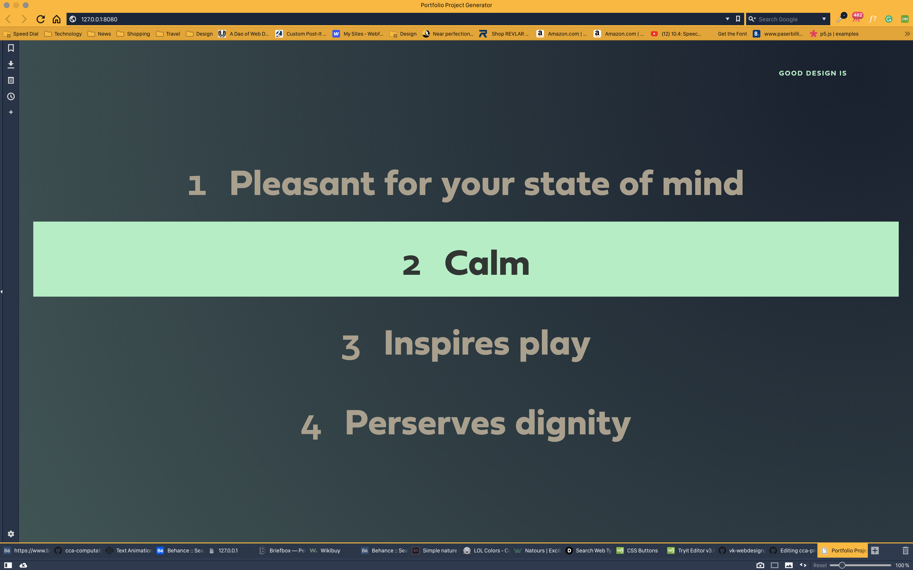

NB: You might find useful the [sample proposal for a software/hardware project](https://github.com/zamfi/cca-programming-electronics-fall-2017/blob/master/hw/sample-proposal.md) useful in completing this assignment!

# Design inspiration generator

A micro-site that will help designers formulate projects with prompts and parameters. I find that coming up with good ideas to work on for portfolio can be time-consuming or can be something that can be hindered by overthinking. This micro-site will help designers cut down on the time needed to come up with real-world ideas, and get a move on desiging!

## Summary

##### Here, write a paragraph or two describing what you built for your final project and what was challenging. 
I built a micro-site designed to help designers come up with portfolio project ideas when they have free time to work on their own projects. The prompts are meant to inspire direction and expand a designers versatility within their portfolio. This site uses a database of established Bay Area companies as well as prompts for non-profit causes, musical artists and sports teams.

##### Include a discussion how it will be interactive or responsive to the environment.
Users will be able to roll randomly generated prompts that deliver unique design project ideas. 

## Component Parts

From what pieces did you build your project?

## Challenges
##### A brief discussion of what was hard, challenging, or unexpected about your project.
The challenges I faced while creating this project was the implementation of Dribbble or Behance APIs. Both of them are dated and are possibly not functional. I had to readjust my gameplan a couple times in order to complete this project on time. It was also a bit of a challenge to get all of the site components to work together proporly but I think I now have a good framework to improve upon.

## Timeline

What did you do in each of the past five weeks?

- Week 1: Write proposal// set up respritory and initial files/workspace
- Week 2: Research API implementation and API experiementation// Setup workspace.// dribble API not functional, dated// Implementing Behance API. // update workspace to acomodate p5 and inserts Behance API.
- Week 3: Behance API not functional // readjust layout // implement Rita.JS // font research // implement functionality
- Week 4: Visual design and styling // increase functionality // add prompts to Rita.JS database // Refine everything for presentation.
- Week 5: Present!

## Completed Work

## References and links
API Link: http://developer.dribbble.com/v2/
API implementation tutorial: https://www.youtube.com/watch?v=Q0pHYugySXU
Library working with Dribbble API: https://jribbble.glitch.me
